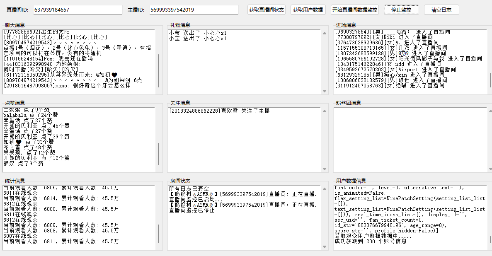
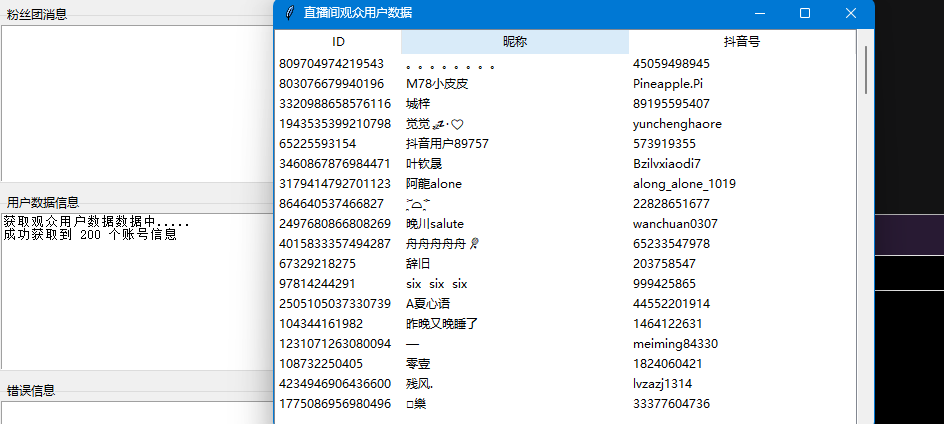

# 🚀 抖音直播间数据采集工具
## 侵权或涉及相关利益请联系作者：[B站](https://space.bilibili.com/1106862890?spm_id_from=333.1007.0.0)、[邮箱](mailto:2431361351@qq.com)

> **声明**  
> 本代码库所有代码仅用于学习研究交流，严禁用于包括但不限于商业谋利、破坏系统、盗取个人信息等不良不法行为。违反此声明所产生的一切后果均由违反声明者承担。  

> *2025年7月20日*

---

## 🌟 核心功能  
  
> 🛡 本工具提供图形化界面，支持实时抓取抖音直播间多维数据：

> 🔴 直播间实时数据  
>**实时在线人数**：秒级更新当前在线观众数量  
> **累计观看量**：统计历史总观看人次  
> **弹幕消息流**：滚动展示实时观众评论与互动  
>**礼物打赏记录**：捕捉礼物类型、发送者及价值  
**用户进出动态**：实时追踪观众进出直播间行为  

> 👤 观众个人数据  
**基础信息**：昵称/抖音号/性别/地区/个人简介  
**社交资产**：粉丝量级/关注数/作品发布量  
**互动热力图**：高互动用户自动标记(下一个版本）  
**行为轨迹**：观众停留时长/发言频率/礼物贡献值  
**关联图谱**：粉丝团成员/管理员特殊身份标注  

> 🛡️ 严格遵循隐私规范，敏感信息自动脱敏处理  
---

## 🛠️ 环境配置
### 环境：
- windows 11
- python 3.8+
- `protoc`版本：`libprotoc 25.1`
- NodeJs v18.2.0
- ## Buy me cookie

## 预览1

## 预览2

